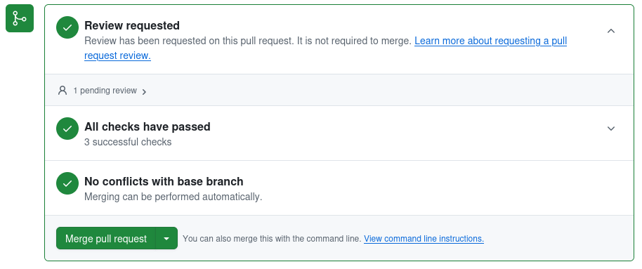

.. _checklist:

.. |snpit_utils| replace:: ``snpit_utils``
.. _snpit_utils: https://github.com/Roman-Supernova-PIT/snpit_utils
.. |snpit_utils/tests| replace:: ``snpit_utils/tests``
.. _snpit_utils/tests: https://github.com/Roman-Supernova-PIT/snpit_utils/tree/main/snpit_utils/tests
.. |snpit_utils/.github/workflows| replace:: ``snipit_utils/.github/workflows``
.. _snpit_utils/.github/workflows: https://github.com/Roman-Supernova-PIT/snpit_utils/tree/main/.github/workflows
                                             
===========================
Checklist for creating a PR
===========================

The right way to edit code is not to commit directly to the ``main`` branch, but to work in either a forked repository, or in another branch, and then to submit a pull request (PR) to merge your branch to the ``main`` branch.  Then, somebody else will review your code so that we have two sets of eyes on any code before it gets merged into the main branch.  When all is well, the PR will be merged.

This is the set of steps necessary to create a new PR whose tests from this template will pass.

Edit your code
===============

Do what you would normally do in a PR: add the new feature or bug fix to the forked repo or to the non-``main`` branch you're working in.

Write tests
===========

For anything you change are add, make sure to write tests that verify the changed/fixed behavior, and/or that test the new behavior you've added; see `Testing your package <testing>`_.

Automatic tests for PRs on github
---------------------------------

If one does not exist already, you may wnat to create a github workflow file to automatically run all of the tests in your archive.  Contact one of the pipeline managers (including, but not limited to, Megan and Rob) for help with this.  You can find an example in the |snpit_utils|_ repository.  There, look in the |snpit_utils/tests|_ subdirectory.  The files ``test_config.py`` and ``test_logger.py`` (at least) were written to test code in this repo.  The file ``docker-compose.py`` sets up a standard ``snpit`` docker environment in which to run the tests.  You may be able to adapt this ``docker-compose.py`` file, changing only the directory names (which may be as simple as replacing ``snpit_utils`` with the directory names for your repo).

If you have a working ``docker-compose.py`` file in the ``tests`` directory of your repo, in that directory try running::

  docker compose run runtests

and you will see if your tests pass or fail... or if the whole thing fails.  After you run your tests, clean up your system with::

  docker compose down -v

Once this is working, you need to add the actual github workflow file.  You can find an example of this file in the
|snpit_utils/.github/workflows|_ subdirectory of the ``snpit_utils`` package.  Look at the file ``run_snpit_utils.tests.yml``.  Once again, it's possible that you can adapt this to your project by simply finding all instances of ``snpit_utils`` and replacing it with your module name.

If you need help with the docker compose file, or with the github workflow file for running your tests in the snpit docker image, talk to Rob, who wrote these things for ``snpit_utils``.

Create the PR
=============

TODO

Make sure automatic checks pass
===============================

On github, if you click, on the "Pull requests" link at the top of the page for your repo, you will get a list of current PRs, including yours.  Click on your PR, scroll down, and find the box that looks something like:

Each of the three green checkmarks will be a big red **X** if something is wrong.

Code Review
-----------

Depending on how your code is set up, this may start with a green check, or may start with a red **X**.  If the text, like in the example, says that the review is not required to merge, you should still get that review and not merge until you have confirmation from whoever is doing that review.  (We may adjust the package template so it defaults to requiring a review.)  If somebody has reviewed the code and indicated to github that they approve it, then this will be a green check, but as noted, a green check doesn't guarantee that that has happened.

Checks/Tests
------------

The middle check in the image above has to do with the tests that are set up to run automatically when you create the PR, or when you push any changes to the branch the PR is pulling from.  If this is a moving brown circle, it means the tests are still in progress.  If it's a red **X**, then something failed.  Click on the name of the failed tests to see the output and try to figure out what went wrong.  You'll want to either fix these, or (in exceptional circumstances) understand why the tests fails and why its OK, before getting a code review.

Conflicts with base branch
--------------------------

The third thing in the list above is actually the first thing you should think about.  If the third thing in the list is marked as not working, that almost certainly means that there have been commits to the ``main`` branch of the repo that are not included in the branch that you're submitting for a pull request.  You will need to merge the branch into your branch (the exact procedure for which differs based on whether you're in a forked repo or a branch of the primary repo), and deal with any conflicts in that merge.  Push your new branch, and ideally this check should clear up.

Add a news fragment
===================

You need to add a small file that will be appended to the changelog of your package.  (This changelog as a single file does not exist in your repo, but will exist when you package it up to send to PyPi.)

Make sure you have the right things in your environment
-------------------------------------------------------

Ideally, if you're using the standard SN PIT environment (either via Conda or in a Docker image), everything will already be there, and you can ignore this section.

You need to have

* ``towncrier``

Creating the news fragment
--------------------------

``towncrier``, which is run as part of the standard github actions tests, requires all PRs to have at least one new "news fragment".  In the top level directory of your repo, run::

  towncrier create <PR#>.<extension>

where ``<PR#>`` is the number of your pull request.  ``<extension>`` should be one of ``docs``, ``bugfix``, ``feature``, or the name of your package.  There is a bit of a chicken-and-egg problem here in that you have to create the pull request before you know this number; in so doing, the tests will fail, because you won't have created the news fragment yet.  So, just accept that the tests will fail right after you create the PR.  Create it, and having done so figure out what the number of the PR is.  Then, run the command above.  This will create a new file ``changes/<PR#>.<extension>.rst``.  Edit that file and put in a short one-line desription of what you've done.  Perhaps reference any Issue numbers that you are addressing.  Add that file with ``git add`` and ``git commit``, and then ``git push`` again.  This step of the tests on github should now pass.  (No promises for any other tests.)

So, for example, suppose your package is ``guide``, and you've just fixed a bug.  You know that you are doing pull request #42 (because you've already submitted it, and had the tests fail because you didn't have any changes in this PR).  In this case, you would run ``towncrier create 42.bugfix``.  That will create a file ``changes/42.bugfix.rst``.  You might then edit that file and replace its contents with::

  added the answer (Issue #42)

You'd then run ``git add changes/42.bugfix.rst``, ``git commit``, and ``git push``.

Merge the PR
============

When all is ready, either you or the code reviewer should merge the PR to main.  **Do not just press the big friendly "Merge pull request" button**.  Rather, click the little down arrow, and find the option "Squash and Merge".  What that will do is remove all of the sundry complicated and perhaps sordid commit messages from your branch, and replace it with a single clean commit message for your PR on the main branch.  Put the text for this single clean commit in the top text box, and then delete everything in the bigger text box.  Finally, push the "Squash and Merge" button.

After merging the PR to main — bump the version if appropriate
==============================================================

(If you're nervous about this, talk to one of the pipeline managers (including, but not limited to, Megan and Rob) about what to do.)

There may be further changes to the branch of your PR based on code reviews.  Once all of that is done and you're ready to merge to main, you probably need to do one more thing: bump the version.

Figure out what the current version of the package is by running::

  git pull -a
  git checkout main
  git tag

That will list the tags that are currently defined for the repo.  Find the ones that look like `semantic versioning <https://semver.org/>`_ (you really only need to read the short "Summary" section on that link, but read the rest if you're morbidly curious).  Decide which numbers you need to change based on what changes are in this PR.  Once you've figured out what your new version is going to be, create a git tag with this new version.  So, for example, suppose the highest tagged version you found existing was `1.9.5`.  Suppose you've added new functionality, but in a backwards compatible manner.  (So, you have new functions or methods, but you didn't change anything so all code that uses your code will still work as-is.)  In this case, you would want to bump the minor version number, and your new version would be `1.10.0`.  You would then run::

  git tag 1.10.1
  git push origin --tags

